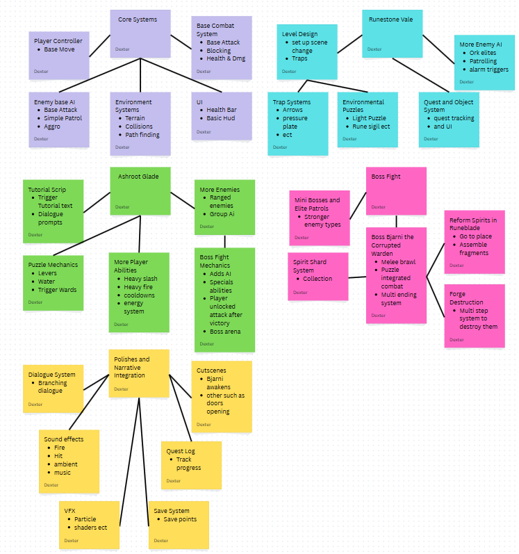

# Defence of Thornvail
## Table Of Contents
- [How to Play](#how-to-play)
	- [Controls](#controls)
   	- [How to Run](#how-to-run)
- [Preplanning](#preplanning)
  	- [What made the original game great](#hwhat-made-the-original-a-game-great)
  	- [How My Game Is Diffirent](#how-my-game-is-diffirent)
  	- [Story Plan](#story-plan)
  		- [Background](#background)
  	   	- [First Level](#first-level)
  	   	- [Second Level](#second-level)
  	- [Gameplay Plan](#gameplay-plan)
  		- [General](#general)
  	  	- [First Level](#first-level)
  	  	- [Second Level](#second-level)
  	- [Production Plan](#production-plan)
  	- [If i get more time](#if-i-get-more-time)
  	- [Assets](#assets)
- [Prototypes](#prototypes)
  	- [Prototype 1](#prototype-1)
  		- [Important Additions](#important-additions)
  	   	- [Video of Functionality (link to youtube)](#video-of-functionality-link-to-youtube)
  	   	- [Issues](#issues)
  	   	- [Next Steps](#next-steps)
- [Reflection](#reflection)
  	- [How is the overall design](#how-is-the-overall-design)
  	- [What changes could i make](#what-changes-could-i-make)
  	- [What would i do diffirently](#what-would-i-do-diffirently)
  	- [Issues I Encountered](#issues-i-encountered)
  	- [What have i learnt](#what-have-i-learnt)

## How to Play
### Controls

### How to Run

## Preplanning
### What Made the Original a Game Great
The Legend of Zelda revolutionized video game design with its expansive open world, non-linear exploration, and blend of action and puzzle-solving. Players controlled Link through the vast land of Hyrule, navigating forests, mountains, and hidden dungeons while collecting items, solving puzzles, and defeating enemies. Unlike most games of the time, Zelda encouraged free exploration, allowing players to tackle challenges in nearly any order and rewarding curiosity with secrets and upgrades. It also introduced a persistent inventory system that remixed the game for added challenge after completion.

Zelda was groundbreaking—it was the first console game to use battery-backed memory, allowing players to save their progress without passwords. This, along with clever use of memory management, enabled a world much larger and deeper than what was typical for the NES. Critically acclaimed and commercially successful, The Legend of Zelda sold over 6.5 million copies worldwide and set the standard for action-adventure games. Its influence is still seen today in open-world design, and it remains one of gaming's most iconic and celebrated titles.

### How My Game is Diffirent

### Story and Gameplay Plan 
#### Background
Thornvail a vast magical forest that once served as a natural barrier between human and ork lands, until some ancient force was lost. The forest is ancient and full of secrets, ruins, puzzles and mysteries. It is now under siege by an army of Orks. 
 
The orks are led by the warlord Brokil the Flame-Eater, who broke the forest's magical barrier. In doing so they’ve unleashed wild magic, warping the environment and awakening dangerous creatures. Their goal, to conquer and claim the Heart of the Forest, a source of immense power. 

#### First level - Ashroot Glade 
* Tutorial area. 
* Start in a area that teaches movement
* Move to a place that introduces combat and then blocking
* Then move out into the real meat of the level
* Second combat teaches you your heavy attack
* Ork raiders are burning the forest. 
* Puzzle: Divert water to extinguish fires and activate protective wards. 
* Boss: Blazetooth, an ork beastmaster. After kill you get your big attack

#### Quest Ideas
📜 Awakening in the Ash  
Objective: You wake in a grove scarred by flame. The air is thick with smoke, and the earth is charred.   
You Must:  
* Move through the grove learning basic movement.  
* Explore the enviroment.  
* Meet a dying guardian spirit.

📜 First Blood on Burning Leaves  
Objective: Ork scouts are patrolling the outer grove. A test of steel and courage.  
You Must:  
* Engage in your first combat encounter and learn its mechanics.  
* Survive two short fights: one vs a lone ork, then a group with a ranged attacker.  

📜 Embers in the Roots  
Objective: The grove’s ancient trees are aflame. If not stopped, the warding magic here will collapse completely.  
You Must:  
* Redirect the nearby stream to put out the fire.  
* Activate an ancient ward node after extinguishing the fire.  

📜 The Beastmaster’s Trail  
Objective: A hulking ork known as Blazetooth is capturing corrupted beasts and razing key glades.
You Must:  
* Track Blazetooth by following claw marks and broken trees.
* Defeat any encountered patrols of orks.

📜 Trial by Flame – Blazetooth  
Objective: Defeat Blazetooth, the ork beastmaster, and save the forest from complete destruction.
You Must:  
* Enter the burning grove to face Blazetooth and his warped pets.
* Use what you learned through the tutorial to defeat him.
* Unlock the way to Runestone Vale.
  
#### Level Map - Ashroot Glade

#### Second level - Runestone Vale
* Old ruins filled with puzzles and challenges.
* projectile/arrow traps.
* Combat: Trapped rooms, enemy patrols, and mini-boss elite guards. 
* Boss: Bjarni, a possessed forest guardian — fight includes puzzle mechanics (break the soul chains while dodging attacks).

#### Quest Ideas
📜 Behind Enemy Vines  
Objective: You've breached the perimeter of Runestone Vale, a newly constructed ork fortresss.  
You Must:  
* Infiltrate the ork camp's perimeter.
* Disable two watchtowers to prevent reinforcments.
* Question a captured guardian to learn what the orks are doing in the vale.

📜 Chains Beneath the Stones  
Objective: Discover the source of corrupted magical surges.  
You Must:  
* Explore the lower mining pit where the orks are unearthing ancient wards.
* Navigate the mines to reach the inner prison vault.
* Witness the source of the magical surges.

📜 The Warden's Remains  
Objective: To weaken Bjarni's bindings, you must reclaim shards of his spirit to help free his mind.
* Recover pieces of Bjarni's spirit (It is not required to recover all shards but it will make the boss fight easier)
* Desecrated Grove - defend a guardians last stand to recieve shard
* Ork Ritual Pit - Interrupt a dark ritual and steal back a shard.
* Broken Shrine - Repair the shrine to collect a shard.

📜 Camp of Iron and Flame  
Objective: Strike at the heart of the ork operation, a forge where they're creating twisted weapons powered by stolen magic.  
You Must:  
* Destroy enchanted forges
* Free prisoners
* Collect runeblade fragments

📜 The Corrupted Warden - Bjarni  
Objective: Bjarni has been chained, tortured, and twisted by the orks. You now face him in a corrupted arena to stop his release.  
You Must:  
* Enter the central prison. Solve puzzles in combat and break his chains.
* Phase 1: Bjarni in his corrupted state rampages through the room.
* Phase 2: step on rune sigils and align lights to weaken him.
* Phase 3: Use the runeblade and the spirite shards to either - Cleanse his corruption (if all shards were collected) or 'end' his corruption 

#### Level Map - Runestone Vale

#### Player Progression
You start as a knight in the kingdom of Thornvail, during the tutorial you learn basic movement and your base attack and block, later you learn two special abilitys one slash heavy attack and a heavy fire attack you get after defeating the first boss. 

### Flowcharts (Production plan)

### If i get more Time

### Assets
I found my games assets on Itch.io.
https://aamatniekss.itch.io/topdown-fantasy-forest

https://zerie.itch.io/tiny-rpg-character-asset-pack

## Prototyping
### Prototype 1 
#### Important Additions - Player Movement and Attack, Tilemap 

#### Video of Functionality (link to youtube)

#### Issues 

#### Next Steps

## Reflection 
### How is the overall design 

### What changes could i make

### What would i do diffirently 

### Issues I Encountered

### What have I learnt

 
